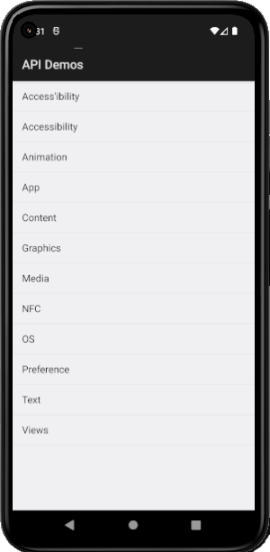

# FirstAPIDemosAppiumProject
### Creation of the Android mobile project that performs Desired Capability configurations and various types of tests in the API Demos app.

#### Description:

This example project demonstrates the creation of a Mobile Test Project for Android called "FirstAPIDemosAppiumProject". 
This project is not architected using test construction methodologies such as TDD (Test Driven Development) or BDD (Behavior Driven Development).
However, concepts such as packages, code reuse, among other concepts and good practices were included.

The Test Project called <b>FirstAPIDemosAppiumProject</b> is currently divided as follows:

- A package with a Driver Session Creation class;
- Example classes for using various Appium resources using Selenium with the **"API Demos.apk"** app;
- The app **API Demos-debug.apk** located in **resources >> appAndroid >> ApiDemos-debug.apk**.

#### Features:

The <b>API Demos-debug.apk</b> app has several screens, menus and free features to test. It is not a commercial app just for different tests.

Each class created has the following main objectives: testing whether the app's activity flows are being carried out successfully, testing whether each functionality is being carried out successfully, testing whether the elements on the screens are having the expected behavior and having the same tests to be performed. carried out, but in different ways, for example, with different technological approaches.

#### Image:

#### Dependencies:
>
    <!-- https://mvnrepository.com/artifact/io.appium/java-client --> >
    <dependency>
        <groupId>io.appium</groupId>
        <artifactId>java-client</artifactId>
        <version>9.3.0</version>
    </dependency>
    Name: Java Client
    Description: Java client for Appium Mobile Webdriver
>
    <!-- https://mvnrepository.com/artifact/org.slf4j/slf4j-simple -->
    <dependency>
        <groupId>org.slf4j</groupId>
        <artifactId>slf4j-simple</artifactId>
        <version>2.0.16</version>
        <scope>test</scope>
    </dependency>
    Name: SLF4J Simple Provider
    Description: Binding/provider for SLF4J, which outputs all events to System.err. Only messages of level INFO and higher are printed.
>
    <!-- https://mvnrepository.com/artifact/org.junit.jupiter/junit-jupiter-api -->
    <dependency>
        <groupId>org.junit.jupiter</groupId>
        <artifactId>junit-jupiter-api</artifactId>
        <version>5.11.0</version>
        <scope>test</scope>
    </dependency>
    Name: JUnit Jupiter API
    Description: JUnit Jupiter is the API for writing tests using JUnit 5.
>
    <!-- https://mvnrepository.com/artifact/org.jetbrains/annotations -->
    <dependency>
        <groupId>org.jetbrains</groupId>
        <artifactId>annotations</artifactId>
        <version>24.1.0</version>
    </dependency>
    Name: JetBrains Java Annotations
    Description: A set of annotations used for code inspection support and code documentation.
>

#### Credits:
This project made in Appium as well as its app **API Demos-debug.apk** was based on the following course:
- https://www.udemy.com/course/the-complete-appium-course-for-ios-and-android/

#### Important Links:
###### Appium Desired Capabilities
- https://appium.io/docs/en/2.1/guides/caps/  
- https://appium.github.io/appium.io/docs/en/writing-running-appium/caps/  
###### UiSelector class
- https://developer.android.com/reference/androidx/test/uiautomator/UiSelector  
- https://stuff.mit.edu/afs/sipb/project/android/docs/tools/help/uiautomator/UiSelector.html  
- https://www.waldo.com/blog/uiselectors-testing-with-appium  
###### Vysor app
- https://www.vysor.io/  

#### Observation:

Although there are IOS code snippets in the CreateDriverSession class, they are not functional at the moment because IOS application codes 
work only on MAC operating system and it is not possible to continue creating/configuring and testing them.
These are commented.

This project was created by **Alexandre Rodrigues da Silva**.